# Ville-3D-et-Minecraft

Il existe plusieurs possibilités pour importer des données 3d dans le jeu Minecraft (ou dans sa version libre [minetest](https://www.minetest.net/))

Nous allons ici en passer quelques unes en revue.

## Table des matières

Cliquer sur les liens ci-dessous pour accéder à la section

[Minecraft](#Minecraft_a_la carte)

[Worldpainter](#Worldpainter)

[Tinkercad](#Tinkercad)

[Voxélisation](#Voxélisation)

[MCEdit](#Import_de_fichiers_schematic_avec_MCEdit)

[Bibliographie](#Bibliographie)

-----------------

## Minecraft_a_la carte

### Site de l'IGN

[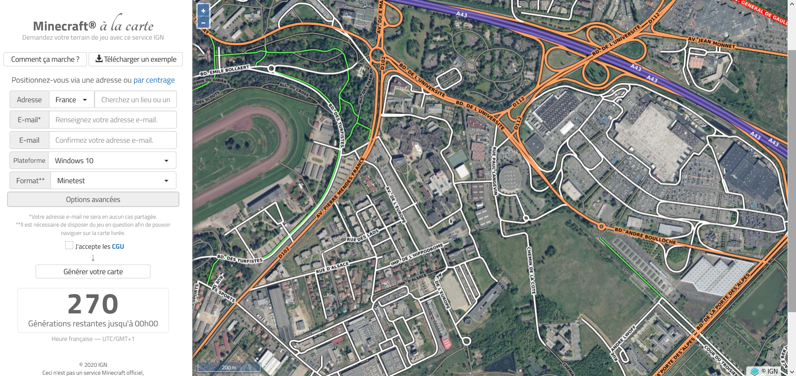](https://minecraft.ign.fr/#) L'IGN propose un service qui permet de générer une carte lisible par le jeu Minecraft ou sa version gratuite Minetest à partir d'une emprise d'un maximum de 5km par 5km. 
Le site de l'IGN est accessible en cliquant sur l'image ci-contre ou avec ce [lien](https://minecraft.ign.fr/#).

La carte va être générer en fonction des données capitalisées par l'IGN et permet de retrouver la topographie du site ainsi que les bâtiments, cependant ceux-ci se ressemblent tous et il est nécessaire de prendre du recul pour bien voir reconnaître les lieux.

### Créer la carte

La première étape consiste à définir l'emprise de sélection des données : tout se passe dans l'onglet à gauche du site internet :

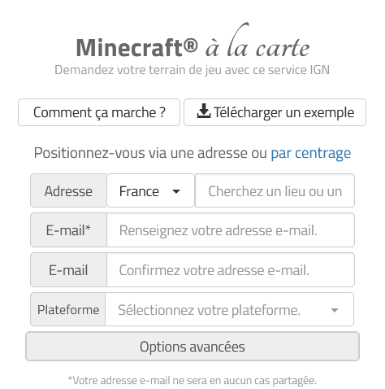

Il existe deux possibilités pour créer cette emprise, soit en renseignant une adresse, soit en utilisant l'option *par centrage* qui permet de positionner un axe xy sur la carte. Le centre de la carte étant défini, il faut maintenant rentrer les quelques options disponibles.

La première d'entre elle étant la plateforme sur laquelle se trouve le jeu (Windows 10, Linux, Mac ou encore Xbox...). Cette option sélectionnée ouvre la suivante, c'est à dire le format du jeu (c'est ici que l'on peut choisir le format minetest par exemple).

Ensuite des réglages avancés sont disponibles, c'est ici notamment que l'on peut régler la taille de l'emprise souhaitée.

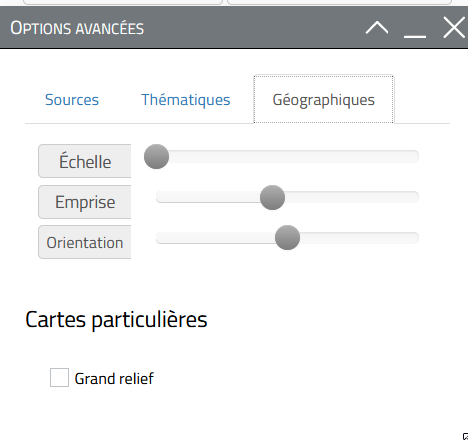

Il faut renseigner son mail, puis cliquer sur générer la carte, il y a un nombre limité de génération de cartes par jour pour l'ensemble des utilisateurs, si le compteur est à zéro, il faudra retenter sa chance le lendemain. De même, une seule carte par adresse mail par jour.

### Récupérer la carte et mettre le dossier au bon endroit

La carte est générée en plus en mois longtemps en fonction de l'emprise qui a été choisi. Elle est adressée par mail, il suffit de cliquer sur le lien pour télécharger le fichier zip (attention, le lien n'est valable que 72h).

L'étape suivante est assez simple il faut décompresser le fichier récupérer le dossier *_alac. C'est dans ce dossier que se trouve les fichiers qui vont permettrent de construire la carte.

Ce dossier doit simplement être déplacé au bon endroit en fonction du format choisi : 

* Dans le cas de Minecraft c'est par défaut dans le dossier : C: / Utilisateur / "Nom utilisateur" / AppData / Roaming / .minecraft / saves. 
C'est donc dans le répertoire *saves* qu'il faut copier le dossier *_alac

* Dans le cas de Minetest : C:\Program Files (x86)\minetest-*version*\worlds
C'est donc dans le répertoire *worlds* qu'il faut copier le dossier *_alac

### Jouer dans le monde créé avec minecraft à la carte

Enfin la dernière étape pour retrouver le monde créé, il suffit de lancer le jeu et de sélectionner le monde par exemple dans le cas de minetest :

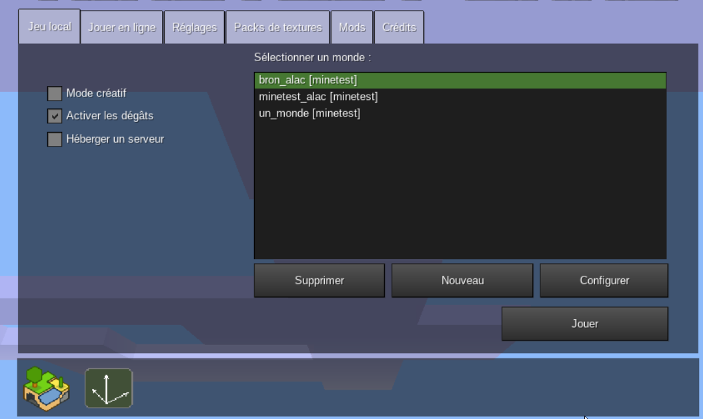

Dans ce cas nous avons créé un monde en sélectionnant l'emprise du campus de Bron.

Nous pouvons constater sur la figure suivante que le monde généré ne correspond pas complètement à la réalité, sur l'image nous voyons le bâtiment E. L'IGN ne possède que l'emprise au sol des bâtiments, le résultat nous montre que les trois amphis avec leur forme circulaire et la partie nord du bâtiment.

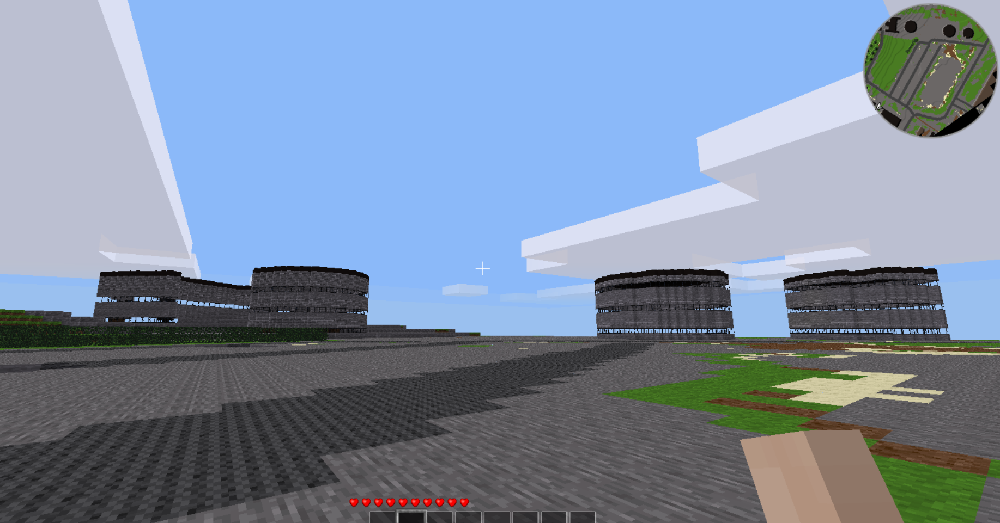

Ceci étant dit, minecraft à la carte permet de générer facilement l'emprise d'un territoire existant et de s'en servir de base pour reproduire le plus fidèlement possible l'environnement. 

Démonstration sur Minecraft par Lubin avec une carte de Lyon.

-----------------

## Worldpainter

World painter est un logiciel de génération de monde minecraft. Il se présente comme un outil permettant de "dessiner son monde" comme sur Paint.

A télécharger cliquant sur le lien suivant : [WorldPainter](https://www.worldpainter.net/)

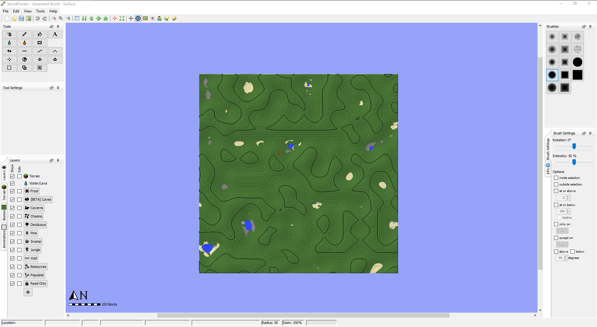

World painter permet notamment d'importer des images laissant ainsi la possibilité d'importer des MNT (Modèle Numérique de Terrain) : menu "Edit" --> Import --> Height Map into current dimension

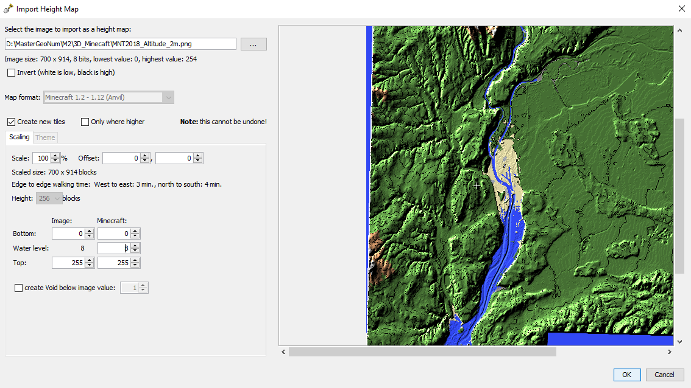

Une fois cette fenêtre ouverte, il faut ouvrir son MNT et paramétrer l'import dans World painter, en jouant sur l'échelle (Scale : à 100% par défaut ce qui signifie 1 pixel de l'image du MNT = 1 cube dans le jeu) et également sur le niveau de l'eau (Water Level)
-----------------

## Tinkercad

Tinkercad est un logiciel en SAAS édité par Autodesk qui permet de créer gratuitement des objets en 3d pour de l'impression en 3D ou pour les exporter dans divers formats.

C'est un logiciel qui est assez simple d'utilisation, il existe plusieurs tutoriels sur internet pour le prendre en main. Le lien suivant est une vidéo youtube pour construire une maison : [tuto maison](https://www.youtube.com/watch?v=3LVAEuAWW_M).

Nous avons réalisé une forme de bâtiment très simple pour montrer le résultat : 

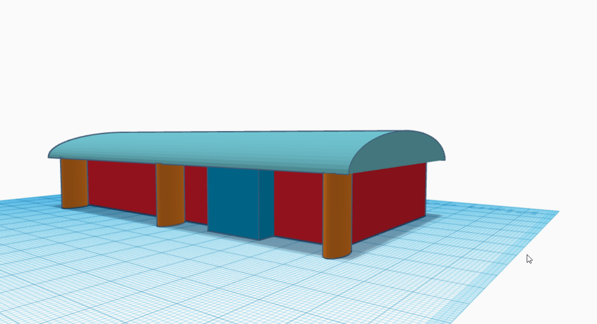

Tinkercad permet de visualiser le résultat de la modélisation transformé en bloc en cliquant sur l'icone suivante (à noter qu'il permet aussi la visualisation en briques légo) : 

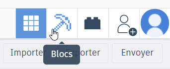

Le résultat est le suivant : 

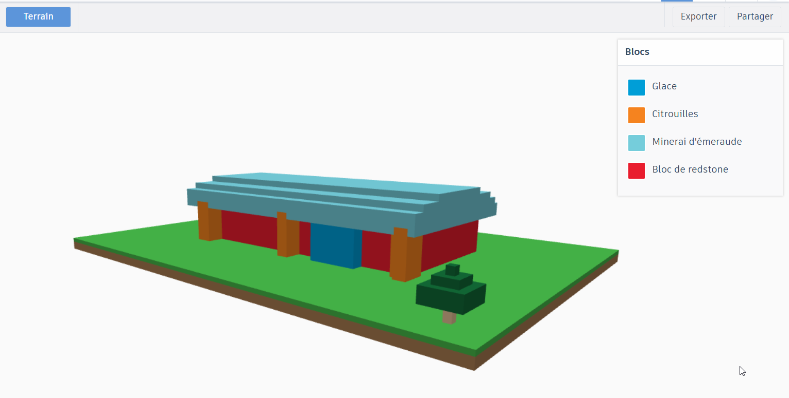

Il est possible de choisir le détail de la modélisation avec plus ou moins de bloc, donc plus ou moins de précision dans la représentation du bâtiment.

Une fois la construction du modèle 3d réalisé, il faut exporter le bâtiment au format voulu. Quand l'utilisateur est dans le mode conception 3d, il peut choisir plusieurs formats d'exports dont *.obj* et *.svg* ou choisir directement un modèle d'imprimante 3d.
Ce qui nous intéresse dans notre cas, c'est quand l'utilisateur est dans le mode bloc, quand il clique sur exporter le seul format d'export proposé est le *.schematic*, format que nous allons pouvoir exploiter avec Minecraft comme nous l'expliquons dans cette [section](#Import_de_fichiers_schematic_avec_MCEdit).

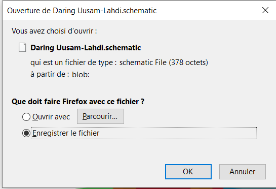

Cette solution permet de créer facilement des bâtiments et de les exporter dans un format qui est exploitable avec Minecraft, nous pouvons imaginer que combiné avec la création d'une carte depuis une emprise avec Minecraft à la carte, il peut être facile de reproduire l'environnement d'une ville avec ses bâtiments remarquables par exemple.

Ce n'est cependant pas la seule solution et nous allons voir dans la section suivante comment créer des fichiers schematic à partir de fichier *.obj*.

-----------------

## Voxélisation

A partir d'un fichier .obj, il est assez facile de créer un fichier [schematic](https://www.minecraft-france.fr/tutoriel-les-schematics/) qui est un format d'échange de structure créé par la communauté de joueur minecraft. Ce type de format peut être chargé dans une carte grâce à MCedit que nous verrons plus [bas](#Import_de_fichiers_schematic_avec_MCEdit). Dans un premier temps, nous allons voir comment transformer un fichier .obj au format schematic.

### vox_package 

[vox_package](https://minecraft.gamepedia.com/Programs_and_editors/Binvox) est une archive qui comprend deux exécutables, un pour voxéliser (binvox) (passer un objet 3d texturé en cube) et l'autre pour visualiser (viewvox) le résultat de la voxélisation.

#### Installation des applications

Comme il s'agit d'une archive, il suffit de la télécharger puis de la dézippé à l'endroit souhaité. Pour utiliser au mieux les fonctions proposé par les deux exécutables, la ligne de commande est le plus simple, il faut donc pouvoir retrouver son dossier avec l'archive de la façon le plus simple possible. Dans l'exemple ci-dessous, le dossier se situe sur le bureau :

    cd C:/Users/"utilisateurs"/Desktop/vox_package

#### La voxélisation

L'exécutable binvox permet de voxéliser un fichier depuis plusieurs types de format : Wavefront OBJ, VRML 2.0, UG, OFF, DXF, XGL, POV, BREP, PLY, JOT. Dans la documentation, le format .obj semble le plus approprié pour cette opération.

En sortie, deux formats sont possibles : le .binvox qui peut être visualiser dans viewvox et schematic qui ne peut être visionné mais qui servira par la suite. 

Il est conseillé de faire une première sortie au format binvox afin de voir le résultat de la voxelisation. Ceci permet de régler les paramètres au fur et à mesure.

Pour lancer une voxélisation simple, la commande suivante doit être lancée depuis la ligne de commande dans le bon dossier (nous supposons ici que le fichier .obj se trouve dans le même dossier que l'exécutable).

    binvox {nom_fichier.obj}

La commande se lance, le fichier .obj est parcouru : 

[]

En fonction de la taille, cela peut être plus ou moins long (plus de 25 min dans le cas du fichier Poleymieux terrain complet), dans le cas d'un petit fichier, à la fin du traitement nous apercevons furtivement le résultat du traitement :

[]

La commande a créé un fichier binvox qu'il est possible de voir avec viewvox en lançant la commande : 

    viewvox {nom_fichier.binvox}

La visionneuse se présente ainsi : 

[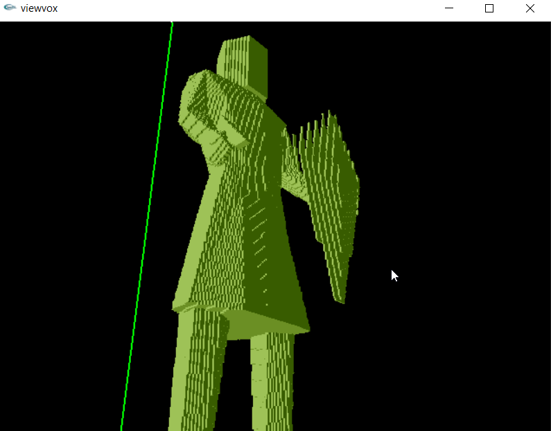]

Nous pouvons qu'elle est assez rudimentaire mais cependant suffisante pour voir le résultat. Les contrôles de zoom sont détaillés sur le [wiki](https://minecraft.gamepedia.com/Programs_and_editors/Binvox).

Ces deux opérations permettent d'affiner la voxélisation, en effet il y a plusieurs paramètres sur lesquels il est possible de jouer, notamment sur le nombre de cube générés ce qui déterminera la finesse de la figure finale. Ces paramètres sont détaillés dans le wiki cité ci-dessus.

Enfin lorsque la figure correspond au rendu souhaité, il est temps de créer le fichier .schematic avec la commande suivante :

    binvox {nom_fichier.obj} {parametre_1} {parametre_2} -t schematic

Les paramètres sont bien évidemment ceux déterminés lors des essais précéedents, le seul paramètre qui va changer cette fois et celui du format d'export, c'est le paramètre -t qui permet de préciser que le format sera du schematic.

Ainsi un fichier schematic est créé pour l'utiliser dans une carte minecraft il faut se reporter à la section [suivante](#Import_de_fichiers_schematic_avec_MCEdit)

-----------------------

## Import_de_fichiers_schematic_avec_MCEdit

## Bibliographie

[minecraft à la carte](https://minecraft.ign.fr/#)

Pour pouvoir utiliser minecraft à la carte il faut bien faire attention à la version que ce soit pour minecraft ou minetest.
La version supportée de minetest est disponible ici : [minetest_04.16](https://github.com/minetest/minetest/releases/tag/0.4.16)

Une autre possibilité semble exister pour minetest : [cartOSM](https://framagit.org/marpa/cartosm-ign)

tutoriel d'utilisation de minecraft à la carte : [tutoriel](https://www.wikidebrouillard.org/wiki/Ma_ville_bloc_par_bloc_-_reconstruire_sa_ville_avec_Minecraft_ou_Minetest)

[Génération de carte Minecraft avec WorldPainter](https://www.minecraftforum.net/forums/archive/tutorials/930401-mapping-using-real-world-terrain-data)

générer des bâtiments 3d avec [tinkercad](https://square.banq.qc.ca/projets/tutoriel-transfert-dun-modele-3d-vers-minecraft/)

à suivre
