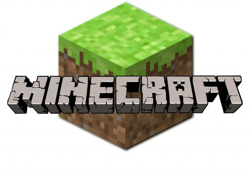
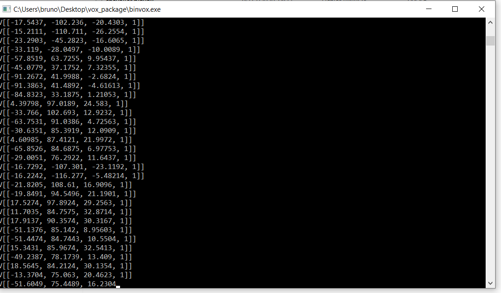
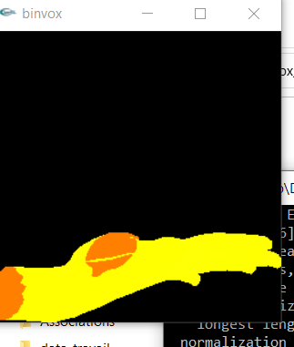

# Ville-3D-et-Minecraft

[minecraft à la carte](https://minecraft.ign.fr/#)

[minetest](https://www.minetest.net/)
Pour pouvoir utiliser minecraft à la carte il faut bien faire attention à la version que ce soit pour minecraft ou minetest.
La version supportée de minetest est disponible ici : [minetest_04.16](https://github.com/minetest/minetest/releases/tag/0.4.16)

Une autre possibilité semble exister pour minetest : [cartOSM](https://framagit.org/marpa/cartosm-ign)

tutoriel d'utilisation de minecraft à la craft : [tutoriel](https://www.wikidebrouillard.org/wiki/Ma_ville_bloc_par_bloc_-_reconstruire_sa_ville_avec_Minecraft_ou_Minetest)

[Génération de carte Minecraft avec WorldPainter](https://www.minecraftforum.net/forums/archive/tutorials/930401-mapping-using-real-world-terrain-data)

générer des bâtiments 3d avec [tinkercad](https://square.banq.qc.ca/projets/tutoriel-transfert-dun-modele-3d-vers-minecraft/)

## Tutoriel pour convertir un fichier .obj en schematic dans minecraft :

A partir d'un fichier .obj, il est assez facile de créer un fichier [schematic](https://www.minecraft-france.fr/tutoriel-les-schematics/) qui est un format d'échange de structure créé par la communauté de joueur minecraft. Ce type de format peut être chargé dans une carte grâce à MCedit que nous verrons plus bas. Dans un premmier temps, nous allons voir comment transformé un fichier .obj au format schematic.

### vox_package 

[vox_package] (https://minecraft.gamepedia.com/Programs_and_editors/Binvox) est une archive qui comprend deux exécutables, un pour voxéliser (binvox) (passer un objet 3d texturé en cube) et l'autre pour visualiser (viewvox) le résultat de la voxélisation.

#### Installation des applications

Comme il s'agit d'une archive, il suffit de la télécharger puis de la dézippé à l'endroit souhaité. Pour utiliser au mieux les fonctions proposé par les deux exécutables, la ligne de commande est le plus simple, il faut donc pouvoir retrouver son dossier avec l'archive de la façon le plus simple possible. Dans l'exemple ci-dessous, le dossier se situe sur le bureau :

    cd C:/Users/bruno/Desktop/vox_package

#### Première étape : la voxélisation

L'exécutable binvox permet de voxéliser un fichier depuis plusieurs types de format : Wavefront OBJ, VRML 2.0, UG, OFF, DXF, XGL, POV, BREP, PLY, JOT. Dans la documentation, le format .obj semble le plus approprié pour cette opération.

En sortie, deux formats sont possibles : le .binvox qui peut être visualiser dans viewvox et schematic qui ne peut être visionné mais qui servira par la suite. 

Il est conseillé de faire une première sortie au format binvox afin de voir le résultat de la voxelisation. Ceci permet de régler les paramètres au fur et à mesure.

Pour lancer une voxélisation simple, la commande suivante doit être lancée depuis la ligne de commande dans le bon dossier (nous supposons ici que le fichier .obj se trouve dans le même dossier que l'exécutable).

    binvox {nom_fichier.obj}

La commande se lance, le fichier .obj est parcouru : 

[]

En fonction de la taille, cela peut être plus ou moins long (plus de 25 min dans le cas du fichier Poleymieux terrain complet), dans le cas d'un petit fichier, à la fin du traitement nous apercevons furtivement le résultat du traitement :

[]

créé un fichier binvox qu'il est possible de voir avec la commande : 

    viewvox {nom_fichier.binvox}

[Tutoriel](https://minecraft.fr/forum/threads/convertir-un-fichier-obj-en-schematic-cest-possible.114445/) (qui date de 2015 donc peut-être obsolète) 
Extension [binvox](https://minecraft.gamepedia.com/Programs_and_editors/Binvox) pour voxeliser des fichiers .obj
